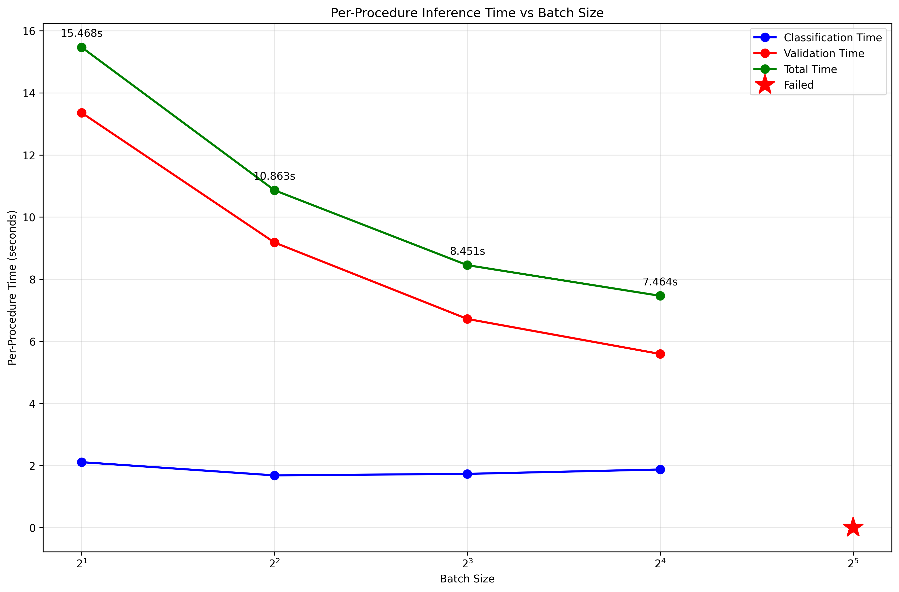

# Medical Procedure Classification Pipeline
This pipeline uses the google/medgemma-27b-text-it model to classify cancer surgery procedure descriptions into purpose categories.

BUILD WITH VIBE-CODING! (with minimal interventions)

The model classifies descriptions of surgical procedures in an oncology setting into one of these categories:
- **Diagnostics**: Biopsies, diagnostic procedures
- **Tumor removal**: Resections, excisions, tumor removal procedures  
- **Hemostasis**: Bleeding control procedures
- **Access**: Port placement, catheter insertion, access procedures
- **Therapeutic Ablation/Embolization**: Ablation and embolization procedures
- **Reconstruction/Repair**: Repair and reconstruction procedures
- **Other**: Procedures that don't fit the above categories

## Set-up
From within a virtual environment, run
```
mamba create -n classifier python=3.10
mamba activate classifier
pip install -Ue .
```

###  Model access
1. Agree to the terms of use at https://huggingface.co/google/medgemma-27b-text-it. 
2. Login to huggingface-hub by running `huggingface-cli login`. Create a token in huggingface by clicking on your profile picture on the upper right hand corner, then `Access Token` > `Create New Token` > `Read` > `Create Token`

###  Model Requirements
- GPU with sufficient memory (recommended: 60GB+ VRAM i.e. A100/H100)
- around 200GB slurm memory

## Usage
1. Run the test the pipeline. This will also test a bunch of batch sizes to determine the optimal batch size for the full run. 
```bash
python src/test.py
```
**Runtime curve on Nvidia H100, bfloat16 without quantization**


2. Run the full classification pipeline on all procedures in `procedure_name.txt`:
```bash
python procedure_classification.py
```

* iris cluster:
```bash
sbatch run_job.sh
```


## Future work
- Prompt tuning with https://github.com/stanfordnlp/dspy