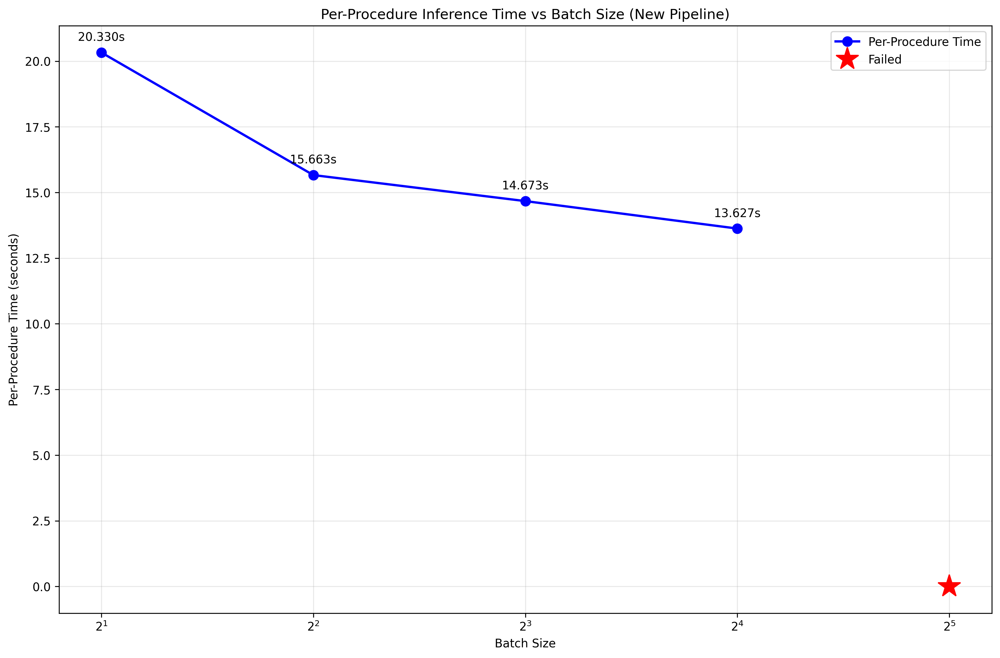
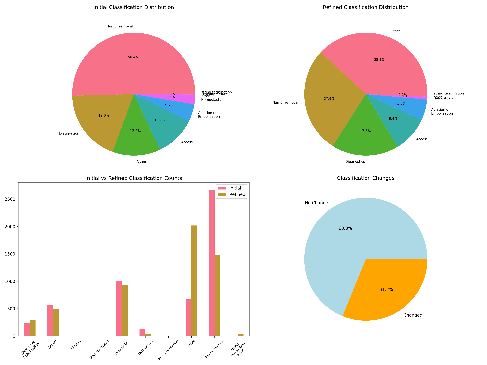

# Medical Procedure Classification Pipeline
This pipeline uses the google/medgemma-27b-text-it model to classify cancer surgery procedure descriptions into purpose categories.

## Set-up
From within a virtual environment, run
```
mamba create -n classifier python=3.10
mamba activate classifier
pip install -Ue .
```

###  Model access
1. Agree to the terms of use at https://huggingface.co/google/medgemma-27b-text-it. 
2. Login to huggingface-hub by running `huggingface-cli login`. Create a token in huggingface by clicking on your profile picture on the upper right hand corner, then `Access Token` > `Create New Token` > `Read` > `Create Token`

###  Model Requirements
- GPU with sufficient memory (recommended: 60GB+ VRAM i.e. A100/H100)
- around 200GB slurm memory

## Usage
1. Run the testing pipeline. This will run the job config complate in `/task_test`. The test will also plot a performance curve to help determine the optimal batch size for the full run. 
```bash
python test.py
```
**Runtime curve on Nvidia H100, bfloat16 without quantization**


2. Run the full classification pipeline. For sample job templates, refer to `/task_surgery_classification` and `/task_radiation_site`:
```bash
python run_task.py task_surgery_classification
```
* iris cluster:
```bash
sbatch run_job.sh task_surgery_classification
```

## Surgerical procedure classification task



## Known failure modes
- In thinking mode, model might fail to terminate gracefully with an answer.
- If the input string is too short, under-specified, or hard to parse, the mode might fail to recognise it as relevant medical information. It can stall and ask for more info instead of performing the desired classification task
- The model can hallucinate categories that are not user-specified. A second pass (refer to the refinement stage of [this pipeline](task_surgery_classification/surgery_classification.json)) typically resolves this.

It is always good practice to manually validate the model's output before using it elsewhere.


## Future work
- Prompt tuning with https://github.com/stanfordnlp/dspy